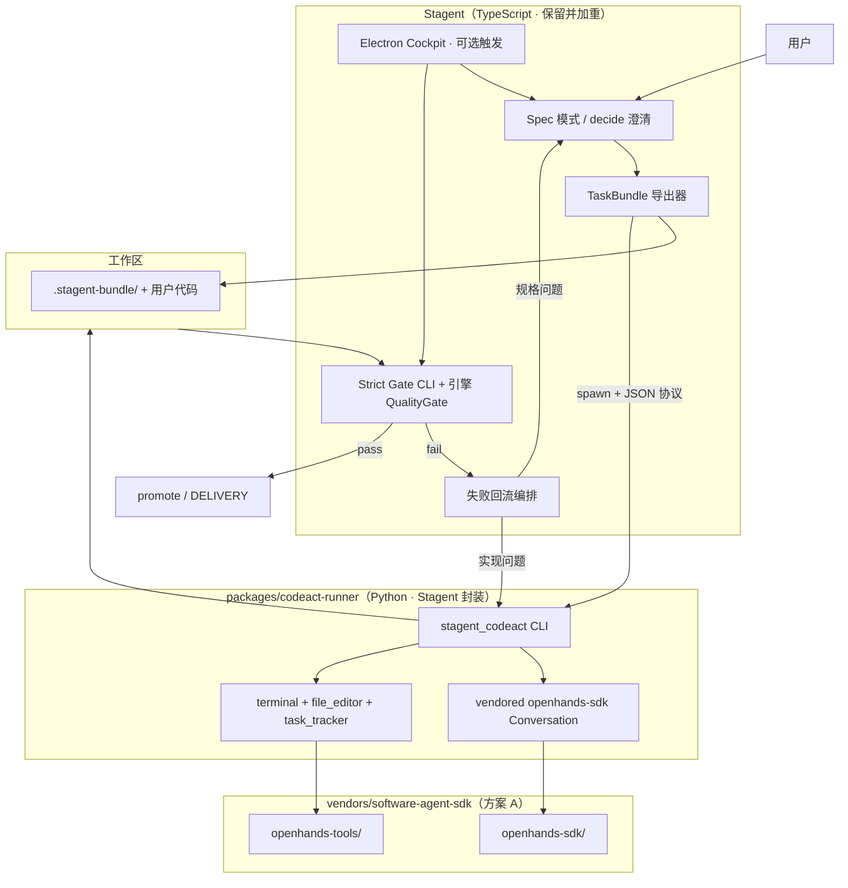

# 瘦身 Stagent + 内嵌 CodeAct + 重 Gate — 商业化实施计划

> **状态**：草案 v0.2（2026-06-18）— **方案 A 已落地（vendoring + runner 骨架）**  
> **目标**：在中国大陆可商用交付的「规格官 + 质检官（Stagent）+ 实现引擎（内嵌 OpenHands SDK）」产品形态。  
> **约束**：不调用 OpenHands 云端 API/CLI；实现能力以**仓库内 vendored Python 运行时**提供。  
> **SSOT 关联**：`docs/orchestration-plan.md`、`docs/comercial/期货策略-可验收回测规格.md`、`docs/adr/0004-t4-delivery-hardening.md`、`docs/adr/0008-strict-gate-gaps-integration-smoke.md`

---

## 0. 执行摘要

| 维度 | 决策 |
|------|------|
| Stagent 保留 | Spec 澄清、决策表、`TaskBundle` 导出、**Strict Gate**、失败回流、Electron/Headless 宿主 |
| 内嵌实现引擎 | **方案 A**：`vendors/software-agent-sdk/`（`openhands-sdk` + `openhands-tools` **1.28.0**） |
| Runner 封装 | `packages/codeact-runner/stagent_codeact/`（Stagent 自有，**非** `openhands.*` 命名空间） |
| T4 类任务 | **降级**引擎内 `llm-text` 全切片 impl；**外包**给 CodeAct Runner |
| 清晰任务（T6/T7） | CodeAct 直出 + Stagent Gate；Spec 模式可选 |
| 唯一交付口 | `stagent gate strict`（包装 `assertStrictMvpPass` + `acceptance.sh`） |
| 大陆商用 LLM | DeepSeek / 通义 / 智谱等 **OpenAI 兼容端点**（LiteLLM 路由，密钥本地 `.env`） |

**关键事实**：CodeAct 实现在 [software-agent-sdk](https://github.com/OpenHands/software-agent-sdk)，**非** `OpenHands-main`。本仓库已按 **方案 A** 精简 vendoring（仅 sdk + tools + LICENSE），见 `vendors/software-agent-sdk/VENDOR_INFO.md`。

### 0.1 方案 A 落地状态（2026-06-18）

| 项 | 路径 | 状态 |
|----|------|------|
| Vendored SDK | `vendors/software-agent-sdk/openhands-sdk/`、`openhands-tools/` | ✅ 已复制 |
| 第三方声明 | `vendors/THIRD_PARTY_NOTICES.md` | ✅ |
| Runner 包 | `packages/codeact-runner/` | ✅ 骨架 |
| 安装脚本 | `npm run codeact:install` → `scripts/codeact/install-venv.sh` | ✅（需 **Python ≥3.12**） |
| 冒烟 | `npm run codeact:smoke` | ✅ 脚本就绪 |
| Spawn | `npm run codeact:run` → `scripts/hybrid/spawn-codeact.mjs` | ✅ |
| Runner 配置接线 | `maxSteps` / `timeoutMs` / `enableBrowser` → SDK `Conversation` | ✅ |
| SDK 事件回调 | `callbacks` → NDJSON `terminal` / `file_edited` / `runner_warning` | ✅ |
| `--fix-prompt-file` | 长 Gate 报告经文件传递，避免 ARG_MAX | ✅ |
| Gate / Export / Hybrid 一键 | `scripts/gate/`、`scripts/export/` | ⏳ Phase 0 余下 |

---

## 1. 目标架构



### 1.1 角色切分

| 组件 | 职责 | 不做 |
|------|------|------|
| `@stagent/core` | decide、plan skeleton、test_write（可选）、QualityGate、HITL | T4 全量 impl 循环（降级） |
| `packages/codeact-runner` | 读 `OPENHANDS_PROMPT.md` + workspace，跑 CodeAct 直到步数/超时 | 自称交付、改验收脚本语义 |
| `scripts/gate/` | **唯一** strict 裁判：`pytest`、默认 `main.py`、`fixtures` 落盘、traceability | — |
| Electron | 触发 hybrid 流水线、展示 Gate 报告 | 不替代 headless |

---

## 2. 仓库目录规划（新增/变更）

```text
Stagent/
├── vendors/
│   ├── THIRD_PARTY_NOTICES.md           # MIT 归属
│   └── software-agent-sdk/              # 方案 A · 已落地
│       ├── LICENSE
│       ├── VENDOR_INFO.md
│       ├── openhands-sdk/               # ~2.8M 源码
│       └── openhands-tools/             # ~852K 源码
├── packages/
│   ├── stagent-core/                    # 现有 · 瘦身编排
│   └── codeact-runner/                  # Stagent 自有 Python 包
│       ├── pyproject.toml
│       ├── .venv/                       # gitignore · npm run codeact:install
│       ├── stagent_codeact/
│       │   ├── __main__.py              # CLI: stagent-codeact run
│       │   ├── runner.py
│       │   ├── bundle.py
│       │   └── protocol.py              # NDJSON 事件
│       └── README.md
├── scripts/
│   ├── codeact/
│   │   ├── install-venv.sh              # vendored editable install
│   │   └── smoke-import.sh
│   ├── hybrid/
│   │   └── spawn-codeact.mjs            # Node → spawn runner
│   ├── gate/
│   │   └── strict.mjs                   # ⏳ Phase 0
│   ├── export/
│   │   └── task-bundle.mjs              # ⏳ Phase 1
│   └── headless/lib/mvp-acceptance.mjs  # Gate SSOT
└── docs/plans/slim-stagent-codeact-integration.md
```

**npm 脚本（已注册）**：

```bash
npm run codeact:install   # 创建 .venv 并 pip install -e vendors/...
npm run codeact:smoke     # import + CLI --help
npm run codeact:run -- --bundle <dir> --workspace <dir>
```

---

## 3. Vendoring 策略 — **方案 A（已采用）**

### 3.1 方案 A：精简源码 vendoring + editable install

| 项 | 做法 | 状态 |
|----|------|------|
| 复制范围 | 仅 `openhands-sdk/` + `openhands-tools/` + `LICENSE` | ✅ |
| 落盘路径 | `vendors/software-agent-sdk/` | ✅ |
| 版本 | **1.28.0**（两包同版本） | ✅ |
| Stagent 封装 | `packages/codeact-runner`（`stagent_codeact.*`） | ✅ |
| 安装 | `npm run codeact:install` → `pip install -e` 两个 vendored 包 + runner | ✅ |
| 未复制 | agent-server、workspace、examples、tests、OpenHands-main | — |
| 许可证 | MIT · `vendors/THIRD_PARTY_NOTICES.md` | ✅ |

**手工复制命令（首次或升级）**：

```bash
SRC=/path/to/software-agent-sdk-main
DEST=/Users/tina/Documents/Stagent/vendors/software-agent-sdk
mkdir -p "$DEST"
cp "$SRC/LICENSE" "$DEST/"
cp -R "$SRC/openhands-sdk" "$SRC/openhands-tools" "$DEST/"
# 更新 VENDOR_INFO.md 版本号
```

**环境要求**：`openhands-sdk` 需要 **Python ≥3.12**。安装前：

```bash
brew install python@3.12 tmux   # macOS
export STAGENT_PYTHON=python3.12
npm run codeact:install
npm run codeact:smoke
```

### 3.2 备选（未采用，仅作对照）

| 方案 | 说明 |
|------|------|
| B · pip 钉版本 | `pip install openhands-sdk==1.28.0`，不 vendoring 源码；内网改 SDK 不便 |
| C · git subtree 整仓 | 体积大；与方案 A 等价但含无用 agent-server |

### 3.3 从 OpenHands-main **仅参考、不复制**的代码

| 参考路径 | 用途 |
|----------|------|
| `openhands/app_server/sandbox/process_sandbox_service.py` | 子进程生命周期、超时 kill |
| `openhands/app_server/app_conversation/live_status_app_conversation_service.py` | tools preset 装配顺序 |
| `skills/` 格式 | 可选：Stagent Skill → microagent 映射（P2） |

### 3.4 运行时依赖（中国大陆部署清单）

| 依赖 | 用途 | 备注 |
|------|------|------|
| Python **3.12–3.13** | CodeAct 子进程 | Electron 打包可捆绑 python-build-standalone |
| `tmux` | TerminalTool | Linux 服务器需预装；macOS `brew install tmux` |
| Playwright Chromium | BrowserTool | **Phase 2**；企业内网可关 `enable_browser=false` |
| DeepSeek API | 默认 LLM | 已有 `DEEPSEEK_API_KEY` / `LLM_BASE_URL` 约定 |

---

## 4. TaskBundle 契约（Stagent → CodeAct）

### 4.1 目录结构 `.stagent-bundle/`

```text
.stagent-bundle/
├── task.json                 # 机读任务描述（见下）
├── 需求分析-南华期货自动下单.md
├── 期货策略-可验收回测规格.md   # 或任务专属 spec.md
├── OPENHANDS_PROMPT.md       # 实现约束（禁止改 tests / 禁止 CTP）
├── config.contract.yaml      # 目录与模块契约
├── scripts/
│   └── acceptance.sh         # Gate 入口（语义冻结）
├── tests/
│   └── test_e2e_signal.py    # L3 oracle 骨架（可预填断言）
└── fixtures/                 # 必须落盘（禁止仅 conftest）
    └── README.md
```

### 4.2 `task.json` 字段（v1）

```json
{
  "version": 1,
  "taskId": "t4-nanhua-futures",
  "taskType": "software",
  "language": "py",
  "workspace": ".",
  "specRefs": ["期货策略-可验收回测规格.md"],
  "mvp": {
    "moduleDirs": ["indicators", "signals", "risk", "broker"],
    "traceabilityRules": "t4-default",
    "smoke": { "run": "main", "minSignals": 1 }
  },
  "codeact": {
    "maxSteps": 80,
    "timeoutMs": 1200000,
    "enableBrowser": false,
    "forbiddenPatterns": ["openctp", "np.random"]
  },
  "llm": {
    "model": "${LLM_MODEL}",
    "baseUrl": "${LLM_BASE_URL}",
    "apiKeyEnv": "DEEPSEEK_API_KEY"
  }
}
```

### 4.3 实现约束（写入 `OPENHANDS_PROMPT.md`）

- **不得修改** `scripts/acceptance.sh`、`tests/test_e2e_signal.py` 中断言语义  
- **不得** `finish` 自判交付；以 Stagent Gate 为准  
- **必须** 将 fixture CSV 写入 `fixtures/` 或 `data/` 并在 `config.yaml` 默认路径引用  
- T4：**禁止** CTP / 实盘 SDK  

---

## 5. CodeAct Runner ↔ Stagent IPC 协议

### 5.1 启动方式

```bash
# 已落地
python -m stagent_codeact run \
  --bundle .stagent-bundle \
  --workspace /path/to/ws

# 或
npm run codeact:run -- --bundle .stagent-bundle --workspace /path/to/ws
```

### 5.2 事件流（stdout NDJSON）

| event | 说明 |
|-------|------|
| `step_start` / `step_end` | 工具调用摘要（不含密钥） |
| `file_edited` | path, op |
| `terminal` | command, exitCode（截断 stdout） |
| `llm_usage` | tokens（计费度量） |
| `runner_done` | reason: completed \| max_steps \| timeout \| error |
| `runner_failed` | message, retryable: bool |

Stagent 将事件写入 `artifacts/codeact-<runId>.jsonl`，供 Cockpit 回放（对齐 OpenHands 会话目录体验）。

### 5.3 失败回流

```text
Gate FAIL
  ├─ category=implementation → 生成 fix_prompt.md（附失败用例）→ 再 spawn Runner（maxRetries=2）
  ├─ category=spec_ambiguity   → 回到 Spec/decide HITL
  └─ category=gate_infra       → 工程问题，不烧 LLM
```

---

## 6. Strict Gate 加重（商业化交付口）

### 6.1 在现有 `assertStrictMvpPass` 上扩展

文件：`scripts/headless/lib/mvp-acceptance.mjs`

| 新增检查 ID | 说明 | 来源教训 |
|-------------|------|----------|
| `G-fixtures-on-disk` | `config.yaml` 指向的 CSV 存在且 size>0 | 第三轮 conftest 绕过 |
| `G-default-main-exit0` | 无额外参数 `python main.py` exit 0 | 第二轮 exit 1 仍 finish |
| `G-signals-nonzero` | `open_long+open_short>=1` 或 oracle 等价 | E3 |
| `G-no-ctp` | requirements / import 扫描 | 第一轮 CTP 漂移 |
| `G-e2e-test-exists` | `tests/test_e2e_signal.py` 存在且 pytest 包含 | P0 补丁 |

### 6.2 新 CLI

```bash
# 唯一交付命令（CI / 本地 / Electron 共用）
npm run gate:strict -- --workspace ./ws --bundle ./ws/.stagent-bundle

# 等价
node scripts/gate/strict.mjs --workspace ./ws --task t4
```

**通过标准**：`exit 0` + 写入 `artifacts/gate-report.json`（供商业 SLA / 客户验收）。

### 6.3 `acceptance.sh` 模板

```bash
#!/usr/bin/env bash
set -euo pipefail
cd "$(dirname "$0")/.."
python3 -m venv .venv
.venv/bin/pip install -q -r requirements.txt pytest pyyaml pandas numpy
.venv/bin/pytest -q
.venv/bin/python main.py
# 解析 backtest_summary.json 或 signals.csv 行数
```

由 `scripts/export/task-bundle.mjs` 从 `live-tasks.mjs` 的 `spec.mvp` 生成。

---

## 7. 工作流变更（@stagent/core）

### 7.1 新工作流档位：`hybrid-software`

| 阶段 | 执行者 | 说明 |
|------|--------|------|
| `stage_decide_*` | Stagent LLM | **保留** |
| `stage_test_write_*` | Stagent LLM | **保留**（生成 oracle 骨架） |
| `stage_test_run_*` | code-runner | RED 确认（可选） |
| **`stage_codeact_impl`** | **external** | **新增** · 替代多切片 `stage_impl_*` |
| `stage_gate_strict` | non-llm | **新增** · 调用 `scripts/gate/strict.mjs` |
| `stage_fix_*` | 条件 | Gate 失败且 implementation → 再 codeact 或轻量 fix |

### 7.2 降级路径

| 任务档 | 旧路径 | 新默认 |
|--------|--------|--------|
| T4/T5 | 全引擎 impl | `hybrid-software` |
| T6/T7 | 全引擎 impl | `hybrid-software` 或 `codeact-only`（无 decide 时可跳过） |
| T1–T3 | 引擎 impl | 暂保留（教学/回归） |

实现挂钩点：

- `packages/stagent-core/src/non-llm-runners/codeact-runner.ts`（spawn Python）
- `packages/stagent-core/src/stage-runners/executeStageStep.ts`（`tool: 'codeact'` 分支）
- `scripts/headless/run.mjs`（`--runner hybrid`）

---

## 8. npm 脚本（产品化入口）

```json
{
  "spec:export": "node scripts/export/task-bundle.mjs",
  "codeact:install": "bash scripts/codeact/install-venv.sh",
  "codeact:smoke": "bash scripts/codeact/smoke-import.sh",
  "codeact:run": "node scripts/hybrid/spawn-codeact.mjs",
  "gate:strict": "node scripts/gate/strict.mjs",
  "hybrid:t4": "node scripts/hybrid/run-hybrid.mjs --tier 4",
  "hybrid:t7": "node scripts/hybrid/run-hybrid.mjs --tier 7"
}
```

`codeact:install` / `codeact:smoke` / `codeact:run` / `spec:export` / `gate:strict` / `hybrid:t4` / `hybrid:t7` **已注册**。

**商业化交付物**：客户/runbook 只暴露 `hybrid:t4` + `gate:strict`，隐藏内部 CodeAct 细节。

---

## 9. Electron 集成（Phase 3）

| 项 | 路径 |
|----|------|
| 主进程 spawn | `src/main/stagent/codeact-bridge.ts` |
| IPC | `stagent:export-bundle`、`stagent:run-codeact`、`stagent:gate-strict` |
| UI | StagentPage 增加「导出包 → 运行实现 → Gate 报告」三步条 |
| Python 路径 | `STAGENT_PYTHON` env 或 `resources/python/`（electron-builder extraResources） |

大陆离线版：安装包内置 `vendors/wheels` + 可选 Chromium（浏览器验收档）。

---

## 10. 分阶段里程碑

### Phase 0 — 骨架（1–2 周）

- [x] **方案 A** vendoring：`vendors/software-agent-sdk/{openhands-sdk,openhands-tools}` + `THIRD_PARTY_NOTICES.md`
- [x] `packages/codeact-runner`：`stagent_codeact` CLI + bundle/protocol/runner 骨架
- [x] `npm run codeact:install` / `codeact:smoke` / `codeact:run`
- [ ] 本机 Python ≥3.12 下 `codeact:smoke` 绿（当前 CI/沙箱若为 3.9 需升级）
- [ ] DeepSeek live：`codeact:run` 跑通最小 workspace
- [x] `scripts/gate/strict.mjs` 包装 `assertStrictMvpPass` + 新 G-* 检查（`npm run gate:strict`）
- [ ] 手工：T7 workspace → export → codeact → gate（PoC）

**退出标准**：T7 OpenHands 实测级产物经 **Gate 自动判 pass**（不需人眼）。

### Phase 1 — TaskBundle + 回流（2–3 周）

- [x] `scripts/export/task-bundle.mjs`（T4/T6/T7 模板）
- [x] `task.json` + `OPENHANDS_PROMPT.md` 生成
- [x] `scripts/hybrid/run-hybrid.mjs`（export → codeact → gate + 回流）
- [ ] Runner NDJSON 事件 + `artifacts/*.jsonl`（capture 已接线，待 live 验证）
- [ ] Gate 失败 → 自动二次 `codeact:run`（`fix_prompt.md` 已生成，待 live 验证）
- [ ] `npm run hybrid:t7` headless 回归入 CI（mock LLM 子集 + 1 条 live 冒烟）

**退出标准**：T7 **hybrid 路径** strict pass ≥ 与纯 OpenHands 手工跑相当。

### Phase 2 — T4 量化 + Gate 加固（2–3 周）

- [ ] `examples/bundles/t4-nanhua/` 含第三轮 P0 oracle 教训（fixtures 落盘）  
- [ ] `hybrid:t4:batch` 连跑 N≥3，报告成功率  
- [ ] 引擎 `hybrid-software` 工作流接入 `run.mjs --runner hybrid`  
- [ ] **降级** T4 全引擎 impl 为 feature flag：`STAGENT_IMPL_ENGINE=legacy`

**退出标准**：T4 strict pass 率 **高于** 纯引擎 live:t4 基线（见 `orchestration-plan`）。

### Phase 3 — 商业化打包（3–4 周）

- [ ] Electron 三步 UI + 离线 wheels  
- [ ] `THIRD_PARTY_NOTICES.md`、用户许可协议中开源声明  
- [ ] 客户 runbook：`docs/comercial/交付-runbook-hybrid.md`  
- [ ] BrowserTool 可选档（T7 UI 点验）  
- [ ] 度量：澄清轮次、CodeAct 步数、Gate 回流次数、token 成本  

**退出标准**：大陆客户环境（DeepSeek + 无 OpenHands 云）**一键安装可演示 T7 交付**。

---

## 11. 测试与 CI

| 层级 | 命令 | 说明 |
|------|------|------|
| L0 | `packages/codeact-runner` pytest | Runner 协议单测 |
| L1 | `npm run test:headless` | 现有 gate lib 单测 + 新 G-* |
| L2 | `npm run hybrid:t7 -- --mock` | 不烧 API |
| L3 | `npm run hybrid:t4:batch` | live 成功率 |
| L4 | `npm run gate:strict` on 固定 fixture workspace | 回归空心绿检测 |

**空心绿回归夹具**：将 `furures_nanhua`（条件 pass）与 `futures_trading` round2（fail）脱敏为 `examples/golden/`，Gate 必须 discriminating。

---

## 12. 风险与对策

| 风险 | 对策 |
|------|------|
| OpenHands-main 误复制 | 文档 + CI 禁止 `enterprise/`；CodeAct 仅依赖 SDK |
| SDK 版本漂移 | `requirements.lock` + 季度 subtree 合并 |
| Python/Electron 双运行时 | 统一 `STAGENT_PYTHON`；安装包捆绑解释器 |
| tmux/Playwright 大陆服务器 | 默认 `enable_browser=false`；文档列系统依赖 |
| Agent 改验收脚本 | Bundle 内 tests hash 校验；Gate 前 `git diff -- tests/` |
| LLM 成本 | `maxSteps`、回流上限 2、per-run token 报表 |
| 许可证 | 仅 MIT 组件；不引入 PolyForm enterprise |

---

## 13. 与现有 ADR/看板的对齐

| 文档 | 关系 |
|------|------|
| ADR-0004 | strict MVP 继续为交付 SSOT；Gate 扩展 G-* |
| ADR-0008 | smoke 非平凡 + 默认 main 纳入 Gate |
| ADR-0006 | decide 用强模型；CodeAct impl 可用快模型 |
| `orchestration-plan` 子任务 | 新增 **#5 hybrid-codeact**（本计划 Phase 0–3） |
| OpenHands 三轮探针 | `examples/bundles` 与 `golden` 夹具来源 |

---

## 14. 立即开工清单

**已完成（2026-06-18）**

1. ✅ `vendors/software-agent-sdk/` — sdk + tools + LICENSE  
2. ✅ `packages/codeact-runner/` + `scripts/codeact/install-venv.sh`  
3. ✅ `scripts/hybrid/spawn-codeact.mjs` + `package.json` 脚本  
4. ✅ `vendors/THIRD_PARTY_NOTICES.md`  
5. ✅ `orchestration-plan` 子任务 #5 登记  

**下一步**

1. 安装 Python 3.12 + tmux → `npm run codeact:install && npm run codeact:smoke`  
2. 创建 `scripts/gate/strict.mjs`  
3. 创建 `scripts/export/task-bundle.mjs` → `examples/bundles/t4-nanhua/`  
4. 创建 `scripts/hybrid/run-hybrid.mjs`  
5. Live：`codeact:run` + T7 Gate PoC

---

## 15. 明确不做（范围外）

- OpenHands SaaS / 多租户 / 计费  
- 复刻 Agent Canvas 全栈 UI  
- 用 CodeAct 替代 Stagent decide/澄清  
- 大陆以外的 exclusive 云托管（本产品定位为**本地/私有化可交付**）

---

*维护：实现会话完成后更新 Phase 复选框与 `orchestration-plan` PR 链接。*
