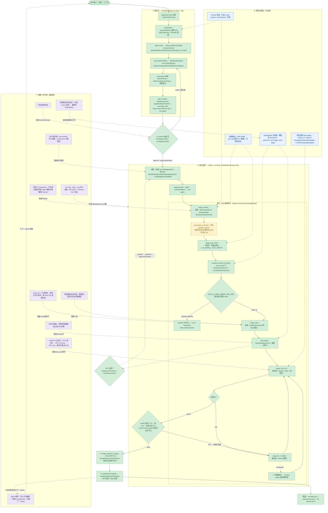

# Stagent 全流程图（合成单图 · 含理想/未开发部分）

> 面向专业技术人员的单张全流程图。综合**已核实实现**（`docs/task-lifecycle.md`、`STAGENT-PRD.md` §4、`packages/stagent-core/src/*`）
> 与**理想/路线图**（ADR-0005~0009、`live-findings-2026-06-15.md`、`orchestration-plan.md`、借鉴分析）。
>
> 图例：✅ 绿=已实现并核实 ｜ 🚧 黄=进行中（有 PR/子任务） ｜ 💡 紫虚线=理想/未开发 ｜ 蓝=贯穿治理层。
> 实线=主控制流；虚线=治理/挂接关系。

---

## 节点状态与依据速查

| # | 阶段 / 能力 | 状态 | 关键模块 / 依据 |
|---|------|------|------|
| ① | 润色 / 澄清·grill / path-router / 计划生成·校验·编译 | ✅ | `TaskPolishPrompt`、`GrillLoopPolicy`、`ScenarioRouter`、`WorkflowGenerationRunner`、`plan-skeleton/*`、`Rule20Verify`、`StartPreconditions`、`disk-bootstrap/applySoftwarePipeline.ts` |
| ② | confirm 确认页 / autoApprovePlan | ✅ | `CanApprovePlan`、`GeneratedWorkflowGate` |
| ③ | 执行循环（线性 / DAG ready 批次） | ✅ | `WorkflowExecutorLoop`、`executor-loop/DagWaveScheduler`、`WorkflowDag.ts` |
| ③ | TDD 切片 decide→test_write→impl→test_run | ✅ | `expandGreenfieldPythonSkeleton`、`stage-runners/executeStageStep` |
| ③ | RED-GREEN / module-contract / forward-slice | ✅ | `GATE_ID_RED_GREEN_PRE_IMPL`、`python-contract/{ModuleContractLint,ForwardSliceImportLint}` |
| ③ | fix_if_failed / runtime-replan | ✅ | `workflow-self-heal/*`、`runtime-replan/*` |
| ③ | smoke 阶段（真启动+断言非平凡+fix 回路） | ✅ PR #11 | `disk-bootstrap/smokeStage.ts`、`verify-smoke-output.mjs`、ADR-0008 |
| ④⑤ | delivery_wrapup / blockDeliveryOnTestFailure / qualityReport / experiences | ✅ | `deliveryWrapupStage.ts`、`quality-report/buildQualityReportPayload`、`WorkflowExperienceStore` |
| ⑥ | Charter / QualityGate / HITL / 难度路由(ADR-0006) / 语言适配(py+node) | ✅ | `charter/*`、`QualityGateIds`、`AdaptiveHITLPolicy`+`ConfidenceScorer`、`scripts/headless/lib/llm-config.mjs`、`language-adapter/*` |
| ③ | prevention-at-decide（pipeline.exports 契约净化） | 🚧 1b | `orchestration-plan.md` 子任务 1b |
| ⑥ | mvp-acceptance Node 模式（requireDirTs） | 🚧→✅ PR #15 | `scripts/headless/lib/mvp-acceptance.mjs` |
| ⑦ | Node 栈引导 / T6n live / zip 交付 | 💡 | ADR-0005 PR-4/5/6 |
| ⑦ | 规则候选自动晋升（学习闭环） | 💡 | 借鉴分析（Totem/PR-Distiller）；现仅 few-shot |
| ⑦ | best-of-N 门控择优 / 对抗审查 / 难度自动升级 | 💡 | 借鉴分析 + 研究（采样+可靠验证器） |
| ⑦ | 宪法门 constitution / 安全审查 | 💡 | 借鉴分析（Spec-Kit constitution） |
| ⑦ | Sprint 循环 / 并行多实例隔离 / CLI host | 💡 | 原始流程图 + worktree 研究 + 产品定位 |

> 核心设计原则（已被实测验证，ADR-0008）：**门的强度比模型档位更决定产物质量**；
> 评审/修复循环必须绑定**可执行外部验证器**（测试 / 真实运行 / smoke），无锚点自检会"假性收敛"（业界自我纠正研究一致结论）。
