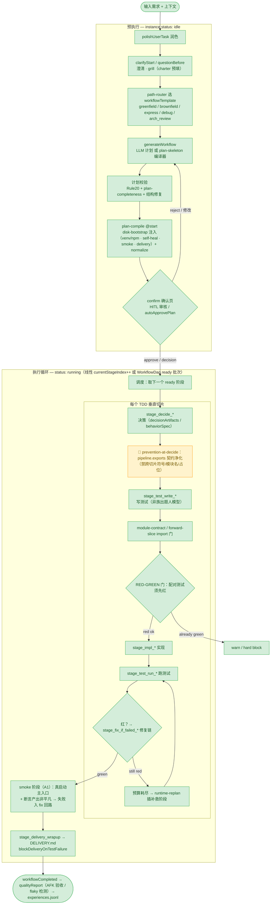
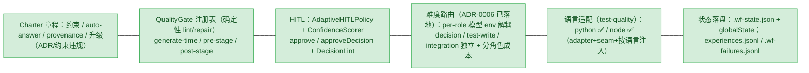
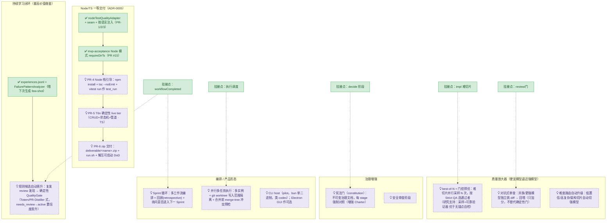

# Stagent 全流程图（含理想/未开发部分）

> 说明：本图综合**已核实的实现**（`docs/task-lifecycle.md`、`docs/STAGENT-PRD.md` §4、`packages/stagent-core/src/*` 源码）
> 与**理想/路线图**（ADR-0005~0009、`docs/live-findings-2026-06-15.md`、`docs/orchestration-plan.md`、借鉴分析）。
>
> 图例：✅ 已实现并核实 ｜ 🚧 进行中（已有 PR / 子任务） ｜ 💡 理想/未开发。

---

## 1. 端到端主流程（已实现 ✅ + 进行中 🚧）

---

## 2. 贯穿式治理层（已实现 ✅，作用于上图各阶段）

---

## 3. 理想 / 未开发部分（💡 路线图，标注挂接点）

---

## 4. 节点状态与依据速查

| 阶段 / 能力 | 状态 | 依据 |
|------|------|------|
| 润色 / 澄清·grill / path-router / 计划生成·编译 / confirm | ✅ | `docs/task-lifecycle.md`、`WorkflowGenerationRunner`、`plan-skeleton/*`、`StartPreconditions`、`disk-bootstrap/applySoftwarePipeline.ts` |
| 执行循环（线性 / DAG ready 批次） | ✅ | `WorkflowExecutorLoop`、`executor-loop/DagWaveScheduler`、`WorkflowDag.ts` |
| TDD 切片：decide→test_write→impl→test_run | ✅ | `expandGreenfieldPythonSkeleton`、`stage-runners/*` |
| RED-GREEN 门 / module-contract / forward-slice | ✅ | `RedGreenGate/Fsm`、`python-contract/*`、`plan-completeness/moduleContractChecks` |
| fix_if_failed / runtime-replan | ✅ | `workflow-self-heal/*`、`runtime-replan/*` |
| smoke 阶段（真启动+断言非平凡+fix 回路） | ✅ | A1 / PR #11、`disk-bootstrap/smokeStage.ts`、ADR-0008 |
| delivery_wrapup / blockDeliveryOnTestFailure | ✅ | `disk-bootstrap/deliveryWrapupStage.ts` |
| qualityReport / experiences | ✅ | `quality-report/buildQualityReportPayload`、`WorkflowExperienceStore` |
| Charter / QualityGate / HITL / 难度路由(ADR-0006) / 语言适配 | ✅ | `charter/*`、`QualityGateIds`、`AdaptiveHITLPolicy`、`scripts/headless/lib/llm-config.mjs`、`language-adapter/*` |
| prevention-at-decide（decide 契约净化） | 🚧 1b | `docs/orchestration-plan.md` 子任务 1b |
| mvp-acceptance Node 模式（requireDirTs） | 🚧→✅ | PR #15 |
| Node 栈引导 / T6n live / zip 交付 | 💡 | ADR-0005 PR-4/5/6 |
| 规则候选自动晋升（学习闭环） | 💡 | 借鉴分析（Totem/PR-Distiller）；现仅 few-shot |
| best-of-N 门控择优 / 对抗审查 / 难度自动升级 | 💡 | 借鉴分析 + 研究（采样+验证器） |
| 宪法门 / 安全审查 | 💡 | 借鉴分析（Spec-Kit constitution） |
| Sprint 循环 / 并行多实例隔离 / CLI host | 💡 | 原始流程图 + worktree 研究 + 产品定位 |

> 核心设计原则（已被实测验证，见 ADR-0008）：**门的强度比模型档位更决定产物质量**；
> 评审/修复循环必须绑定**可执行外部验证器**（测试 / 真实运行 / smoke），无锚点自检会"假性收敛"。
