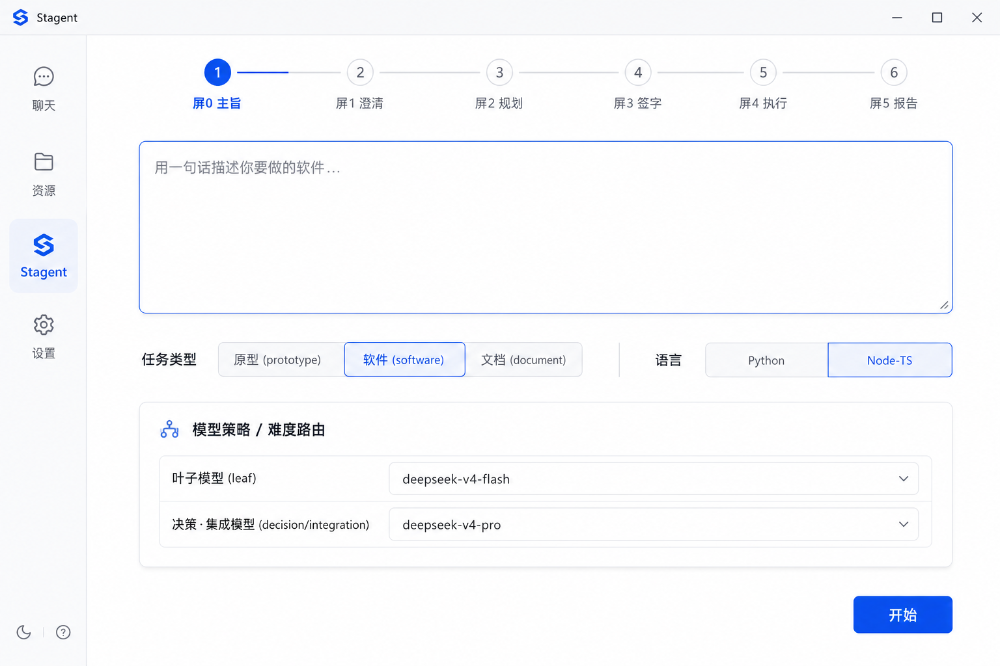
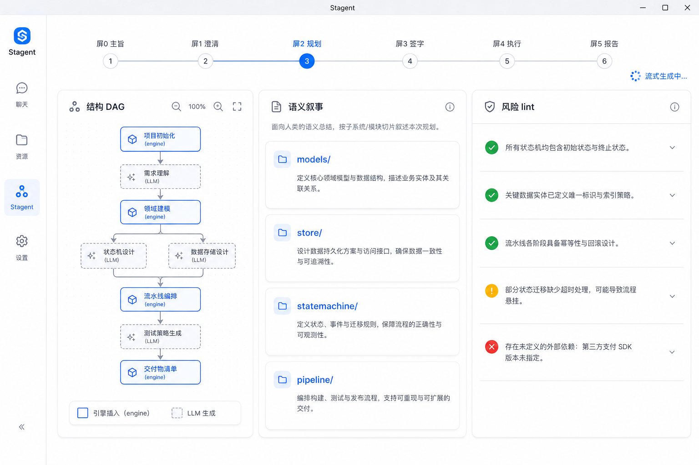
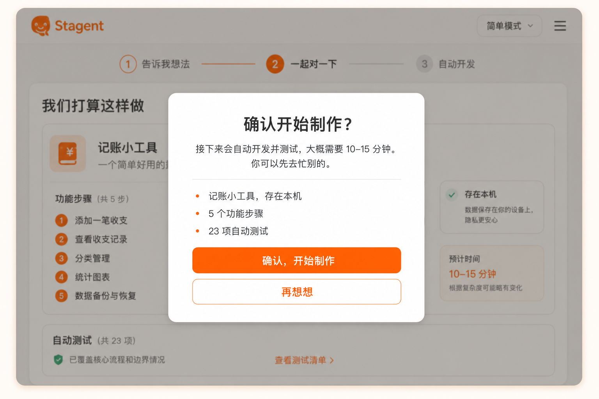

# Stagent 前端设计：六屏质量驾驶舱

> 目标：把现有三屏 MVP（`输入 → 确认 → 执行`）演进为 PRD §3.2 / §10 的**六屏质量驾驶舱**（屏 0–5）。本文锚定现有 `src/renderer` 代码，标注「复用 / 扩展 / 新增」，不含实现，仅设计。

## 现状盘点（src/renderer）

- 壳与导航：`pages/SidebarShell.tsx`、`pages/useSidebarLayout.ts`、`components/TabBar.tsx`
- 页面：`pages/ChatPage.tsx`（统一 AI 聊天）、`pages/ResourcesPage.tsx`（AI 站点/账号）、`pages/StagentPage.tsx`（工作流）
- Stagent 组件：`pages/TaskTree.tsx`、`pages/FileTree.tsx`、`pages/FileEditor.tsx`、`stagent/QualityReportPanel.tsx`、`stagent/useStagentEngine.ts`、`stagent/stagentSeqGate.ts`
- 配置组件：`components/ModelPicker.tsx`、`components/ToolToggles.tsx`、`components/CalibrationOverlay.tsx`

三屏 MVP 映射（PRD §10）：`输入`=屏1 简化、`确认`=屏3 合并、`执行`=屏4。缺：屏0（主旨·信封）、屏2（规划驾驶舱）、屏5（质量报告独立化）。

## 信息架构

`StagentPage` 升级为**工作流向导（stepper）**，按实例状态在屏 0→5 间推进；顶部进度条显示当前屏与已完成屏，可回看只读历史屏。左侧 `SidebarShell` 保留全局导航（Chat / Resources / Stagent / 设置）。

```
SidebarShell
└─ StagentPage（工作流向导：屏0 → 屏5，顶部 stepper）
   ├─ 屏0 主旨·信封
   ├─ 屏1 深澄清（决策闸门）
   ├─ 屏2 规划驾驶舱（三列）
   ├─ 屏3 决策·计划签字
   ├─ 屏4 执行·验证
   └─ 屏5 质量报告 + 交付
```

## 逐屏设计

### 屏0 主旨·信封（新增）
- 目的：一句需求输入 + 任务类型/交付目标确认（对应「决策闸门」上游）。
- 布局：居中大输入框 + 任务类型选择（prototype / software / document）+ 语言（Python / Node-TS，对接 ADR-0005）+ 模型策略入口。
- 模型策略：**难度路由配置**（对接 ADR-0006）——「叶子模型」默认 `deepseek-v4-flash`，「决策/集成模型」默认 `deepseek-v4-pro`，可改。复用并扩展 `ModelPicker`（从单选升级为「按角色分配」）。
- 出口：提交 → 进屏1。

### 屏1 深澄清 / 决策闸门（扩展现「输入」）
- 目的：agent 抽取**必须人工拍板**的决策点，集中提问（每项带推荐默认值 + 理由）；采纳/修改/跳过用默认；可一键全默认（AFK）。
- 复用：`CalibrationOverlay` 的交互范式；charter 代答模式。
- 组件（新增）：`DecisionGatePanel`——决策点卡片列表（问题 / 选项 / 推荐默认高亮 / 理由 / 我的选择）。
- 状态：`needs-input`（等待）/ `resolved`（已定）/ `auto-defaulted`（超时或 AFK 用默认）。
- 出口：全部 resolved → 进屏2。

### 屏2 规划驾驶舱（新增，PRD §10 重点）
- 三列布局：
  1. **结构 DAG**：机读 `WorkflowDefinition` 的 stage 图；**区分引擎插入 vs LLM 生成**步骤（不同描边/角标）。复用 `TaskTree` 升级为 DAG 视图。
  2. **语义叙事**：把计划翻译成人话（plan 的自然语言摘要 + 各切片意图）。
  3. **风险 lint**：plan lint 结果（express 不兼容、缺架构决策等），红/黄/绿分级。
- 流式：plan-generate 过程实时流入（复用 `useStagentEngine` 的事件流）。
- 出口：计划成形 → 进屏3。

### 屏3 决策·计划签字（扩展现「确认」）
- 决策板：已批准 DecisionRecord + behaviorSpec 摘要。
- 计划卡片：按角色着色（decision / impl / test / integration），显示每 stage 将用的**模型**（呼应难度路由）。
- 客观预审：plan lint 列表；**红灯禁止执行**（`CanApprovePlan` / `CanExecute` 门）。
- AFK：`autoApprovePlan` 开启且无升级项 → 自动签字跳过本屏（仅提示）。
- 出口：批准 → 进屏4。

### 屏4 执行·验证（扩展现「执行」）
- 主区：切片执行时间线（Scheduler→Executor→Review 子环），每切片显示 TDD 红绿、闸门（tsc/pytest/vitest）、fix 重试次数、打分。
- 复用：`FileTree` + `FileEditor`（实时看产物）、`stagentSeqGate`。
- 升级人工：仅当打分 < 阈值 / 高风险 / 不可逆 时弹卡（复用 `DecisionGatePanel`）。
- 成本条：按角色（叶子/决策/集成）实时累计 token 与花费（对接 usageMeter + ADR-0006 分角色成本）。
- 出口：全切片 done + 验收 → 进屏5。

### 屏5 质量报告 + 交付（独立化现 `QualityReportPanel`）
- 复用并扩展 `stagent/QualityReportPanel.tsx`：strict 验收（pipeline vs MVP）、各切片测试绿/红、traceability、DefinitionOfDone。
- 交付区：`DELIVERY.md` 预览 + **可运行 zip 下载/打开**（对接 ADR-0005 决策 5 的 zip 交付）。
- 经验沉淀：本轮 experiences 摘要（可写回 CONTEXT）。

## 横切关注点

- **AFK 透明度**：任一屏被 AFK 自动跳过时，顶部 stepper 标注「自动通过（默认值/autoApprove）」，可点开回看依据。
- **可回看**：已完成屏只读可回看；不可逆操作（执行、交付）有明确确认。
- **状态来源**：全部绑定引擎事件流（`useStagentEngine`）与 `planStatus` 状态机；UI 不自造真值。
- **i18n**：复用 core `l10n`（注意现有 `missing l10n key` 告警需补）。
- **可测试**：每屏组件配 `__tests__`（参照现有 `ChatPage.test.tsx` / `task-tree-*.test.tsx` 风格）。

## 双模式：简单模式（非专业用户默认）vs 专业模式

六屏驾驶舱本质是「工程师视角」。为覆盖**非专业用户**，引入全局**双模式开关**：

- **简单模式（默认）**：全程不出现技术黑话；隐藏模型/语言/任务类型/DAG/lint；决策点以「听得懂的问题」呈现；专业细节默认折叠、随时可展开。
- **专业模式**：本文上述六屏驾驶舱全貌。

### 去黑话对照（简单模式文案）

| 专业模式 | 简单模式 |
|----------|----------|
| 屏0 主旨 / 屏1 澄清 / 屏2 规划 / 屏3 签字 / 屏4 执行 / 屏5 报告 | 说需求 → 一起对一下 → 自动开发 → 交付给你 |
| 屏1 + 屏2（澄清 + 规划） | 同属 stepper 第 2 步「一起对一下」（屏1 先问、屏2 再确认计划） |
| 屏3 决策·计划签字 | **无独立屏**；并入屏2「开始做」+ 按需确认弹窗（见下节） |
| 任务类型 prototype/software/document、语言 Python/Node-TS | 隐藏（智能默认，收进「高级设置（开发者）」） |
| 模型策略 / 难度路由（flash/pro、叶子/决策模型） | 完全隐藏（自动选） |
| 结构 DAG（引擎插入 vs LLM 生成） | 折叠进「技术细节（给开发者看）」 |
| 风险 lint | 「需要你确认的地方」+ 大白话问题 |
| 语义叙事 | 「我们打算这么做」+ 人话步骤卡 |

### 视觉稿对比

屏0：

- 专业模式：`docs/assets/stagent-screen0-intent-envelope.png`



- 简单模式：`docs/assets/stagent-screen0-simple-mode.png`


屏2：

- 专业模式：`docs/assets/stagent-screen2-planning-cockpit.png`



- 简单模式：`docs/assets/stagent-screen2-simple-mode.png`


### 简单模式全流程视觉稿

非专业用户走 `说需求 → 一起对一下 → 自动开发 → 交付给你` 四步。**stepper 只有 4 格**，但「一起对一下」内含专业模式的屏1（澄清）+ 屏2（规划）两个子屏；专业模式的屏3 签字**不单独占一步**，并入屏2 的「开始做」与按需弹窗。

说需求（屏0）：


一起对一下（屏1，决策闸门用大白话提问）：


规划确认（屏2，“我们打算这么做”）：


自动开发（屏4，进度 + 自动测试）：


交付给你（屏5，一键下载 + 测试通过）：


### 简单模式交互补充

#### 屏1「我自己选」展开态

默认只展示 1–2 个最关键问题 + 「都用推荐的，直接开始」。用户点「我自己选」后展开更多选项（仍用人话，不出现技术术语），并允许随时「改回全部用推荐」。


交互要点：
- 每题 2–4 个 pill 选项；推荐项带「推荐」小标 + 一行理由。
- 第三题（如「大概什么时候要能用？」）仅在展开态出现——非专业用户默认不必看到。
- 主按钮文案变为「选好了，继续」；底部保留「改回全部用推荐」一键回退。

#### 屏5「怎么用？」帮助页

从交付页的「怎么用？」进入；三步说明 + 折叠 FAQ；全程不出现 zip/npm/终端 等词，只说「下载的文件」「双击打开」。


交互要点：
- 三步卡片：找到文件 → 按提示操作 → 有问题告诉我们。
- FAQ 默认折叠（「打不开怎么办？」「想加新功能怎么办？」）。
- 底部「我学会了，返回」回到交付页；「再下载一次」重复触发下载。

### 简单模式屏3 合并逻辑

专业模式屏3（决策·计划签字）在简单模式中**没有对应 stepper 步骤**，呈现层把签字动作拆成三条路径，全部绑定引擎 `CanApprovePlan` / `CanExecute` / `autoApprovePlan`，UI 不自造真值。

#### 六屏 → 四步映射

```
专业 0   1        2        3      4      5
简单 1   └─ 2 ────┘        3      4
     说需求  一起对一下      自动开发  交付
           ├ 屏1 澄清
           └ 屏2 规划 + 屏3 签字（合并）
```

#### 三条签字路径

| 路径 | 触发条件 | 简单模式呈现 | 引擎门 |
|------|----------|--------------|--------|
| **A 内联确认** | plan lint 有黄灯「需确认」项（非阻断） | 屏2 黄色卡片「需要你确认的地方」+ pill 选项；选完即可点「开始做」 | `CanApprovePlan` 仍 false 直到项 resolved |
| **B 开始前弹窗** | 黄灯已清 / 无升级项；用户点「看起来不错，开始做」 | 居中弹窗「确认开始制作？」摘要 + 预估耗时；不可逆操作二次确认 | `CanExecute` 为 true 时弹窗；确认后 `approvePlan` |
| **C 红灯阻断** | plan lint 红灯（缺架构决策、express 不兼容等） | 屏2 主按钮置灰；红色人话条「还有地方没对上，暂时不能开始」+ 「我想改改」回屏0/1 | `CanExecute` false；**禁止**弹窗 B |

#### AFK / 自动通过

- `autoApprovePlan` 开启且无黄/红灯 → **跳过弹窗 B**，屏2 短暂 toast「已按推荐方案自动开始」，stepper 直接进入「自动开发」。
- AFK 跳过任何屏时，stepper 对应步标注「自动通过」；用户可点开回看依据（与专业模式横切规则一致）。

#### 弹窗 B 视觉稿

用户点「看起来不错，开始做」且引擎允许执行时弹出；背景 dim 屏2 规划页，摘要用屏1 决策 + 屏2 步骤的人话汇总，不出现模型/DAG/lint 词。



交互要点：
- 摘要 3 行以内：做什么、关键选择、测试承诺。
- 预估耗时区间（来自历史 runs 或静态默认「10–15 分钟」）。
- 「确认，开始制作」→ `approvePlan` + 进屏4；「再想想」→ 关闭弹窗留屏2。

### 屏4 / 屏5 polish

#### 屏4「需要你帮忙看一下」（执行中人工介入）

仅当引擎打分低于阈值 / 高风险 / 不可逆分支时弹出**黄色**（非红色）介入卡，复用屏1 的 pill 交互范式；文案经 `toPlainLanguage` 转换，不出现 stage/slice/lint 词。


交互要点：
- 介入卡插入当前任务列表下方，不遮挡整体进度条。
- 标题固定「需要你帮忙看一下」；问题来自 `DecisionGatePanel` 人话改写。
- 用户选择后卡片折叠为绿色「已确认 ✓」，执行继续；超时 AFK 用推荐默认并标注「自动通过」。
- 其余时间主文案强调「你可以先去忙别的」+ 自动测试计数（已有屏4 基线稿）。

基线稿（无介入时的默认态）：


#### 屏5 技术报告展开态

交付页默认折叠「技术报告（给开发者看）」；展开后仍用人话分区，不出现 zip/npm/终端：


交互要点：
- 三区：**做了什么**（3–5 bullet）/ **测试情况**（N/N 通过）/ **文件清单**（友好文件名，非路径）。
- 与「怎么用？」帮助页分工：帮助页面向非开发者操作步骤；技术报告面向开发者扫一眼交付物。
- 「想再改点什么？」条保留在报告下方，点击回到屏0 并预填本轮需求摘要。

基线稿（折叠态）：


### 实现取向

- core 已有 `friendly/toPlainLanguage.ts`，作为简单模式「说人话」转换的基础。
- 简单模式是同一套引擎事件流的**呈现层过滤/改写**，不改引擎真值；模式切换仅影响 UI 显隐与文案。

## 落地顺序（建议）

1. `StagentPage` 引入 stepper 骨架 + 屏 0/1（决策闸门）——价值最高、对接已定的决策模型。
2. 屏2 规划驾驶舱（三列 + DAG）。
3. 屏4 执行时间线 + 成本条；屏5 质量报告独立化 + zip 交付。
4. 屏3 决策签字增强（角色色 + 模型标注 + 红灯门）。

## 待确认

- 视觉风格：沿用现有 Tailwind 设计 token，还是引入新设计系统？
- ~~是否需要产出**视觉稿（图片 mockup）**？~~ → 简单模式主流程 + 屏3 合并 + 屏4/5 polish 视觉稿已产出（见 `docs/assets/stagent-screen*-simple*.png`）。
